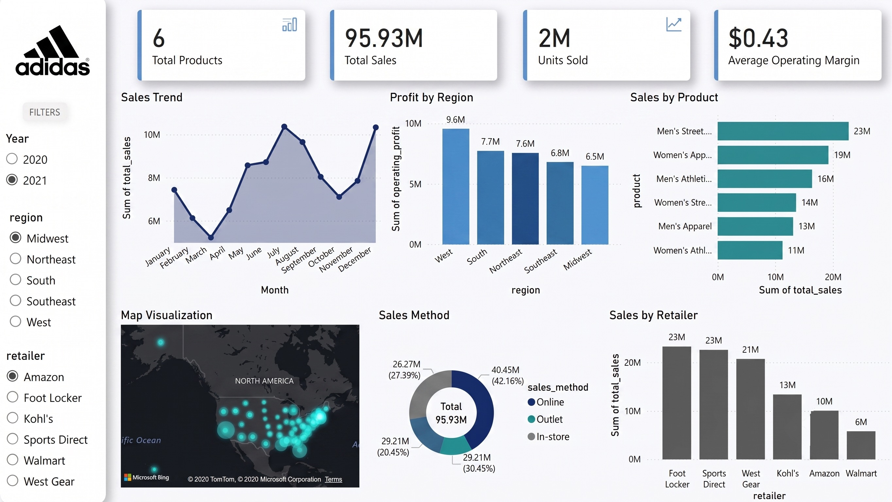

# Adidas Sales Analysis

End-to-end analysis of Adidas' US sales data from raw data cleaning to an interactive Power BI dashboard to identify performance gaps and growth opportunities across products, retailers, regions and sales channels.

**Tools used:** SQL, Python (Pandas), Power BI, DAX

## Overview

- 9,648 transactions across 6 retailers and 50 states (2020-2021)
- $120.2M in total sales and $47.2M in operating profit

## Key Insights

- **Product:** Men's Street Footwear is the top category at $27.7M — 93% ahead of the weakest, Women's Athletic Footwear ($14.3M)
- **Retailer:** West Gear leads in sales ($32.4M), but Sports Direct is the most efficient — 43.2% operating margin vs. West Gear's 37.6%
- **Seasonality:** July-August is peak season, with July sales 63% above the slowest month (March)
- **Channel:** Online is now the largest sales channel at 37%, ahead of Outlet and In-store
- **Growth:** 2021 sales grew 296% year-over-year vs. 2020
- **Pricing:** The $27-$67 price band drives over 2M units sold — the clear sweet spot; demand drops sharply outside this range

## Dashboard

## Recommendations

1. Invest in Women's Athletic Footwear to close the 93% gap with the top category
2. Align inventory and campaigns to the July-August demand peak
3. Double down on the online channel, already the largest and fastest-growing
4. Hold pricing in the $27-$67 sweet spot rather than pushing premium price points
5. Benchmark West Gear's operations against Sports Direct's higher-margin model to lift profitability

## Project Files

| File | Description |
|------|-------------|
| [`Database and Table creation.sql`](./Database%20and%20Table%20creation.sql) | SQL Server schema for the sales table |
| [`ETL.py`](./ETL.py) | Loads cleaned data into SQL Server |
| [`Data Cleaning.ipynb`](./Data%20Cleaning.ipynb) | Python data cleaning and transformation |
| [`Adidas-Sales-Analysis.pbix`](./Adidas-Sales-Analysis.pbix) | Power BI dashboard |

## License

This project is licensed under the [MIT License](./LICENSE).
